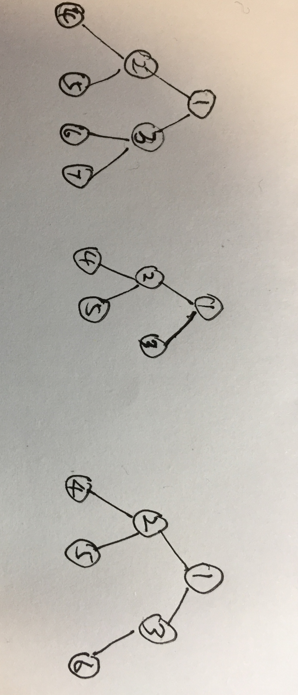

# 树

## 简述

### 树的定义

树是有限个结点的集合,它是非线性数据结构.

任意非空树中:

- 有且仅有一个根结点
- 结点个数大于1时,除了根节点的其他结点分属不同的集合(各集合不相交),每一个集合构成根的子树.

### 结点分类

度: 每个结点拥有的子树的数目成为结点的度.

- 叶结点(终端结点): 度为0的结点
- 分支结点(非终端结点): 度不为0(除根结点以外的结点成为内部结点)

树的度: 树内所有结点中度最大的数目.

层次(级): 根结点为第1层, 根节点的子结点为第2层,以此类推.

树的深度: 树中结点的最大层次

### 基本操作

- 构造
- 清空
- 判断树是否为空
- 深度
- 返回根结点
- 返回某个结点的值
- 为结点赋值
- 结点的父结点
- 插入子树(单个结点或以此结点为根结点的树)
- 删除子树

## 二叉树

每个结点至多两个子树,且子树有左右之分.

深度为k,且有2^k-1个结点的二叉树称为满二叉树.

自上而下依次为:满二叉树,完全二叉树,非完全二叉树

深度为k,且有n个结点的二叉树,当且仅当其每一个结点都与深度为k的满二叉树编号从1到n的结点一一对应时,称之为完全二叉树.

除了输的基本操作之外,二叉树还有以下操作:

- 返回左子树
- 返回右子树
- 返回左兄弟
- 返回右兄弟

### 二叉树的一些性质

- 二叉树的第i层至多`2^(i-1)`个结点
- 深度为k的二叉树至多有`(2^k)-1`个结点
- 任意二叉树,已知度为0的结点个数为a,为2的结点个数为b, a = b + 1
- 具有n个结点的完全二叉树深度为以2为底n的对数+1
- 对一棵有n个结点的完全二叉树的结点按层序编号,对任意一个结点i有:
  - i=1,则i是根节点.若i>1,则其父结点是不大于i/2的最大整数
  - 若2i>n,则结点i无左子结点.若2i<=n,则结点i的子结点是2i
  - 若2i+1>n,则结点i无右子结点.否则结点i的子结点是2i+1

- 二叉树的顺序存储
  - 用一组地址连续的存储单元,依次自上而下,从左至右存储完全二叉树

## 树的表示方法和存储结构

双亲表示方法, 孩子表示方法, 孩子兄弟表示方法

顺序存储结构, 链式存储结构

- 双亲表示法: 每个结点结构体中除了本结点的数据域之外,还有一个记录其父结点位置的域
- 孩子表示法:
- 孩子兄弟表示法:

